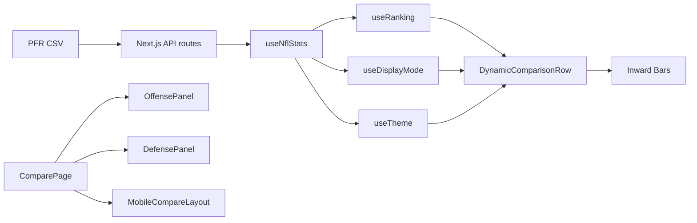

# Architecture Audit — 2025-11-05

## 1) Summary
- Scope: Static scan of repository structure, components, hooks, API routes, and key data flows. No code changes.
- Tools used: repo tree scan, file reads, interface extraction, import graph review.
- Notable findings:
  - Strong parity with `docs/ARCHITECTURE.md`: client-side ranking, hook-based logic, self-contained panels.
  - Additional surfaces beyond ARCHITECTURE.md: `lib/hooks/` (`useIsMobile`, `useScoreboardMock`), mock API routes, scoreboard rail, selection context.
  - API routes return raw CSV→JSON with 6h in-memory cache; ranks computed client-side.
  - Mobile flow present (`components/mobile/*`) with compact panels and dropdowns; desktop panels wrapped in error boundaries.
  - Logging and diagnostics are verbose (hooks/components); consider gating in production.

## 2) File Tree (truncated to relevant dirs)
```
app/
  page.tsx
  compare/page.tsx
  api/
    nfl-2025/
      offense/route.ts
      defense/route.ts
    health/route.ts
    preferences/route.ts
    mock/
      scoreboard/route.ts
      matchup/route.ts
components/
  OffensePanel.tsx
  DefensePanel.tsx
  DynamicComparisonRow.tsx
  RankingDropdown.tsx
  TeamSelectionPanel.tsx
  TeamSelector.tsx
  TeamLogo.tsx
  TeamDropdown.tsx
  CompareHeader.tsx
  MismatchChips.tsx
  FloatingMetricsButton.tsx
  PWAInstallPrompt.tsx
  OfflineStatusBanner.tsx
  SiteLayoutShell.tsx
  ThemeCustomizer.tsx
  ErrorBoundary.tsx
  mobile/
    MobileCompareLayout.tsx
    MobileTopBar.tsx
    MobileBottomBar.tsx
    CompactPanel.tsx
    CompactPanelHeader.tsx
    CompactComparisonRow.tsx
    CompactRankingDropdown.tsx
    CompactTeamSelector.tsx
lib/
  useNflStats.ts
  useRanking.ts
  useDisplayMode.ts
  useTheme.ts
  useBarCalculation.ts
  hooks/
    useIsMobile.ts
    useScoreboardMock.ts
  metricsConfig.ts
  pfrCsv.ts
utils/
  teamDataTransform.ts
  helpers.ts
  logger.ts
  teamAbbr.ts
  teamHelpers.ts
  odds.ts
  time.ts
types/
  matchup.ts
```

## 3) Inventory

### Components
- OffensePanel — `components/OffensePanel.tsx`
  - Props: `offenseData: TeamData[]`, `defenseData: TeamData[]`, `selectedTeamA: string`, `selectedTeamB: string`, `selectedMetrics: string[]`, `isLoading?: boolean`, `onTeamAChange?`, `onTeamBChange?`, `swapVisual?: boolean`.
  - Uses: `useDisplayMode`, `DynamicComparisonRow`, `TeamDropdown`/`TeamLogo`.
- DefensePanel — `components/DefensePanel.tsx`
  - Props mirror OffensePanel with `defenseData` primary.
  - Uses: `useDisplayMode`, `DynamicComparisonRow`, `TeamDropdown`/`TeamLogo`.
- DynamicComparisonRow — `components/DynamicComparisonRow.tsx`
  - Props: `metricKey`, `teamAData`, `teamBData`, `type`, `allOffenseData`, `allDefenseData`, `panelType`, `onTeamAChange?`, `onTeamBChange?`, `swapVisual?`.
  - Uses: `useRanking`, `useTheme`, `useBarCalculation`, `metricsConfig`, `RankingDropdown`.
- RankingDropdown — `components/RankingDropdown.tsx`
  - Props: `allData: TeamData[]`, `metricKey`, `currentTeam`, `type: 'offense'|'defense'`, `side: 'teamA'|'teamB'`, `onTeamChange`, `className?`.
  - Uses: `calculateBulkRanking`, `useTheme`, `teamHelpers`, `framer-motion`, `lucide-react`.
- TeamSelectionPanel — `components/TeamSelectionPanel.tsx`
  - Props: `offenseData`, `defenseData`, `onTeamChange(teamA, teamB)`, `currentTeamA?`, `currentTeamB?`, `isLoading?`, `className?`.
  - Uses: `TeamSelector`.
- TeamSelector — `components/TeamSelector.tsx`
  - Props: `selectedTeam`, `onTeamChange`, `availableTeams`, `label?`, `placeholder?`, `disabled?`, `className?`.
- TeamDropdown — `components/TeamDropdown.tsx`
  - Props: `currentTeam`, `onTeamChange`, `side`, `allTeams`, `label?`, `className?`.
- FloatingMetricsButton — `components/FloatingMetricsButton.tsx`
  - Props: `selectedOffenseMetrics`, `selectedDefenseMetrics`, `onOffenseMetricsChange`, `onDefenseMetricsChange`.
  - Uses: dynamic import of `MetricsSelector`, preload strategies, `framer-motion`.
- MetricsSelector — `components/MetricsSelector.tsx`
  - Props: `type`, `selectedMetrics`, `onMetricsChange`, `maxMetrics?`, `className?`.
  - Uses: `metricsConfig` grouping, `useMemo`/`useCallback`.
- ScoreboardRail — `components/ScoreboardRail.tsx`
  - Props: `onSelect?`, `className?`.
  - Uses: `useScoreboardMock`, `teamAbbr`, `odds`, `time`, `TeamLogo`.
- ErrorBoundary — `components/ErrorBoundary.tsx`
  - Props: `fallback`, `children`.
- MobileCompareLayout — `components/mobile/MobileCompareLayout.tsx`
  - Props: `selectedTeamA`, `selectedTeamB`, `onTeamAChange`, `onTeamBChange`, `offenseData`, `defenseData`, `selectedOffenseMetrics`, `selectedDefenseMetrics`, `onOffenseMetricsChange`, `onDefenseMetricsChange`, `isLoading?`.
  - Uses: `CompactPanel` (offense/defense), `MobileTopBar`, `MobileBottomBar`.
- CompactPanel — `components/mobile/CompactPanel.tsx`
  - Props: `type`, `teamA`, `teamB`, `teamAData`, `teamBData`, `selectedMetrics`, `allOffenseData`, `allDefenseData`, `onTeamAChange?`, `onTeamBChange?`.
  - Uses: `useDisplayMode`, `CompactComparisonRow`, `CompactRankingDropdown`, `CompactTeamSelector`.
- Other presentational wrappers: `CompareHeader`, `MismatchChips`, `PWAInstallPrompt`, `OfflineStatusBanner`, `SiteLayoutShell`, `ThemeCustomizer`.

### Hooks
- useNflStats — `lib/useNflStats.ts`
  - Signature: `(): { offenseData, defenseData, isLoadingOffense, isLoadingDefense, isLoading, offenseError, defenseError, offenseDataFreshness, defenseDataFreshness, lastUpdated, getTeamOffenseData(name), getTeamDefenseData(name), refreshData }`.
  - Notes: Fetches `APP_CONSTANTS.API.ENDPOINTS`, transforms via `teamDataTransform`, logs cache headers, 6h cache on server; client sees freshness via SW headers.
- useRanking — `lib/useRanking.ts`
  - Signature: `(allData, metricKey, teamName, { higherIsBetter=true, excludeSpecialTeams=true }) => { rank, formattedRank, isTied, totalTeams, teamsWithSameValue } | null`.
  - Notes: Tolerance-based equality; bulk API `calculateBulkRanking` also available.
- useDisplayMode — `lib/useDisplayMode.ts`
  - Signature: `(initial='per-game') => { mode, setMode, toggleMode, transformTeamData, transformAllData, isPerGameMode, isTotalMode, modeLabel }`.
  - Notes: Uses consolidated transforms from `utils/teamDataTransform`.
- useTheme — `lib/useTheme.ts`
  - Signature: `() => { theme, setColorScheme, setPanelStyle, setBarStyle, setShadows, toggleAnimations, setTeamAColors, setTeamBColors, getTeamAColor, getTeamBColor, getTeamABarColor, getTeamBBarColor, getTeamAGradient, getTeamBGradient, getPanelClasses, getBarContainerClasses, availableColorSchemes, availablePanelStyles, availableBarStyles }`.
  - Notes: Centralized styling utilities; console diagnostics enabled.
- useBarCalculation — `lib/useBarCalculation.ts`
  - Signature: `({ teamAValue, teamBValue, teamARanking, teamBRanking, panelType, metricName? }) => { teamAPercentage, teamBPercentage, amplificationFactor, amplificationLevel, debugInfo }`.
  - Notes: Rank-gap amplification up to ~2.5x + elite/poor bonus; defense flips values.
- useIsMobile — `lib/hooks/useIsMobile.ts`
  - Signature: `(breakpoint=1024) => boolean`.
- useScoreboardMock — `lib/hooks/useScoreboardMock.ts`
  - Signature: `(pollMs=5000) => { games, isLoading, error, showSkeleton }`.

### API Routes
- GET `/api/nfl-2025/offense` — `app/api/nfl-2025/offense/route.ts`
  - CSV→JSON, 6h in-memory cache, returns `{ season, type, updatedAt, rows, stale? }` (raw, no server ranks).
- GET `/api/nfl-2025/defense` — `app/api/nfl-2025/defense/route.ts`
  - CSV→JSON, same pattern as offense.
- GET `/api/health` — `app/api/health/route.ts`
  - `{ ok: true, version, timestamp, uptime, endpoints, environment }`.
- GET `/api/preferences`, PUT `/api/preferences` — `app/api/preferences/route.ts`
  - Private/no-store stub.
- GET `/api/mock/scoreboard` — `app/api/mock/scoreboard/route.ts`
  - Returns mocked scoreboard array; `no-store`.
- GET `/api/mock/matchup?away=X&home=Y` — `app/api/mock/matchup/route.ts`
  - Returns mocked matchup; `no-store`.

## 4) Data Flow (Mermaid)


## 5) Dependency Edges (key modules)
- `app/compare/page.tsx` → `OffensePanel`, `DefensePanel`, `MobileCompareLayout`, `FloatingMetricsButton`, `OfflineStatusBanner`, `CompareHeader`, `MismatchChips`, `useNflStats`, `useIsMobile`, `useSelection`.
- `components/OffensePanel.tsx` → `useDisplayMode`, `DynamicComparisonRow`, `TeamDropdown`/`TeamLogo`.
- `components/DefensePanel.tsx` → `useDisplayMode`, `DynamicComparisonRow`, `TeamDropdown`/`TeamLogo`.
- `components/DynamicComparisonRow.tsx` → `metricsConfig`, `useRanking`, `useTheme`, `useBarCalculation`, `RankingDropdown`.
- `components/RankingDropdown.tsx` → `calculateBulkRanking`, `metricsConfig`, `useTheme`, `teamHelpers`, `framer-motion`, `lucide-react`.

## 6) Contract Parity vs /docs/ARCHITECTURE.md
### ✅ Matches
- Client-side ranking only via `useRanking`; API returns raw data (no server ranks).
- Business logic in hooks; presentational components render and delegate logic.
- Self-contained offense/defense panels; props-driven global state from Compare page.
- CSV parsing uses position-based column mapping.
- Performance posture aligns with documented targets (cached responses, memoization patterns where needed).

### ⚠️ Divergences
- Additional flows not listed in ARCHITECTURE.md: `lib/hooks/` (mobile detection, scoreboard), mock API surface, selection context and scoreboard rail.
- `metricsConfig.ts` defaults for defense include core subset; ARCHITECTURE.md mentions broader defensive metrics availability (context-dependent). Ensure docs reflect the current defaults.
- Verbose console diagnostics across hooks/components; ARCHITECTURE.md emphasizes performance—consider documenting logging gating.

### 📌 Suggested doc or code updates
- Update `docs/ARCHITECTURE.md` to include `lib/hooks/` and mock API surfaces.
- Document `SelectionContext` (global swap, selectedGame) in data flow and component responsibilities.
- Note dynamic import + preload strategy for `MetricsSelector` in performance section.

## 7) Risks & Hotspots
- Verbose logging in `useRanking`, `useNflStats`, `useTheme`, and UI dropdowns may impact performance in production; gate by env/log level.
- Framer Motion usage in dropdowns on low-end devices can affect frame budget; currently minimal, but monitor.
- Rank amplification math multiplies differences visually; ensure UX expectations are clear and that accessibility labels reflect actual values.
- Multiple dropdowns open-state management (mobile) is carefully handled; regressions could reintroduce overlap/viewport issues.
- CSV mapping is position-based; if PFR changes column order, both offense/defense parsers must be updated promptly.

## 8) Recommendations (surgical)
- `lib/useRanking.ts`: Gate debug `console.log` with `process.env.NODE_ENV !== 'production'` or central logger level. Expected win: less runtime noise.
- `components/RankingDropdown.tsx`: Consider lazy-loading framer-motion for dropdowns or gating animations on `prefers-reduced-motion`. Win: smoother low-end devices.
- `lib/useNflStats.ts`: Move some verbose header dumps behind a debug flag. Win: smaller console footprint.
- `components/mobile/*`: Wrap mobile panels with `ErrorBoundary` where appropriate (desktop already guards panels). Win: better fault isolation.
- `docs/ARCHITECTURE.md`: Add `SelectionContext` and mock APIs to system diagram. Win: parity of documentation.
- `lib/metricsConfig.ts`: Add a short comment listing current default defense metrics vs full set; or expose `DEFAULT_DEFENSE_METRICS` rationale. Win: clarity.
- `app/api/*`: Add `ETag` headers (optional) if future bandwidth optimization is desired. Win: network efficiency.

## 9) Appendix
- Hook signatures: see sections above for return shapes.
- Component prop excerpts: key prop interfaces listed in Components inventory.
- Perf notes: dynamic import + preload for MetricsSelector; memoized bar calculation; client-only ranking with tolerance for tie precision.
