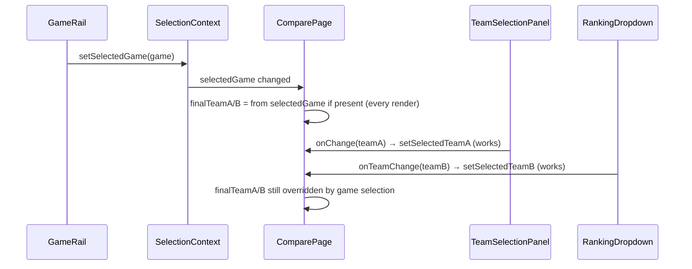

# Team Selection Lock Audit — 2025-11-05

## 1) Root cause
After selecting a game from the rail, `app/compare/page.tsx` always prefers the game-derived teams (`resolvedFromSelection.away/home`) over the locally controlled `selectedTeamA/B`. Because `selectedGame` remains set in context and is never cleared or gated, manual team changes via `TeamDropdown`/`RankingDropdown` are ignored on every render. No disabled props or overlays are blocking clicks; the state is simply overridden by render-time precedence.

## 2) Event flow (Mermaid)


## 3) Proof excerpts
- ComparePage derives final teams by preferring game selection over local state:

```176:179:/Users/owner/Documents/Pare/app/compare/page.tsx
// Final teams used by panels (prefer global selection, otherwise local defaults)
const finalTeamA = resolvedFromSelection.away || selectedTeamA;
const finalTeamB = resolvedFromSelection.home || selectedTeamB;
```

- The game selection is set and persisted in context from the rail (desktop and drawer):

```15:27:/Users/owner/Documents/Pare/components/SiteLayoutShell.tsx
const handleSelectFull = (game: Game) => {
  setSelectedGame({
    awayAbbr: game.away.abbr,
    homeAbbr: game.home.abbr,
    spread: game.spread,
    total: game.total,
    status: game.status,
    quarter: game.quarter,
    clock: game.clock,
    kickoffIso: game.kickoffIso,
  });
  setIsDrawerOpen(false);
};
```

- Manual changes flow through handlers correctly:

```80:88:/Users/owner/Documents/Pare/app/compare/page.tsx
const handleTeamAChange = (newTeamA: string) => {
  setSelectedTeamA(newTeamA);
};
const handleTeamBChange = (newTeamB: string) => {
  setSelectedTeamB(newTeamB);
};
```

Result: handlers update local state, but `finalTeamA/B` still resolve from `selectedGame`, so UI reflects the game-derived teams and ignores manual picks.

## 4) Recommended fix options
- Option A (preferred) — Gate game→team sync (one-time or id-based) and stop render-time override
  - In `app/compare/page.tsx`:
    - Replace always-preferring `finalTeamA/B` with local state as source of truth.
    - Add a `useEffect` that, when `selectedGame` changes (by id) and user has not manually edited teams this session, sets `selectedTeamA/B` from `selectedGame` once.
    - Track a `userHasEditedTeams` flag (set true in `handleTeamAChange/B`) to avoid overwriting manual changes.
  - Sketch:
    ```diff
    // derive names when game changes
    useEffect(() => {
      if (!selectedGame || userHasEditedTeams) return;
      const away = selectedGame.awayAbbr ? abbrToName(selectedGame.awayAbbr) : null;
      const home = selectedGame.homeAbbr ? abbrToName(selectedGame.homeAbbr) : null;
      if (away) setSelectedTeamA(away);
      if (home) setSelectedTeamB(home);
    }, [selectedGame, userHasEditedTeams]);

    // render uses local state only
    - const finalTeamA = resolvedFromSelection.away || selectedTeamA;
    - const finalTeamB = resolvedFromSelection.home || selectedTeamB;
    + const finalTeamA = selectedTeamA;
    + const finalTeamB = selectedTeamB;

    // mark manual edits
    const handleTeamAChange = (t: string) => { setUserHasEditedTeams(true); setSelectedTeamA(t); };
    const handleTeamBChange = (t: string) => { setUserHasEditedTeams(true); setSelectedTeamB(t); };
    ```

- Option B — Add a `source` flag in context
  - Extend `SelectionContext` with `teamSource: 'manual' | 'game'`.
  - When a game is selected, set teams and `teamSource = 'game'` once; when user edits, switch to `manual` and do not apply game-derived values until a new game is picked.

- Option C — Separate derived display from state
  - Keep `selectedTeamA/B` as the only state used by panels.
  - Display the selected game matchup elsewhere (e.g., chips/header) without feeding it back into the teams except via a one-time “Apply from game” action.

## 5) Acceptance checks
- Overwrite lines: Yes — see ComparePage `finalTeamA/B` lines 176–179.
- Disabled/overlay blocking: No — no `disabled`/`pointer-events-none` found on dropdowns; rail drawer closes after select.
- onTeamChange fired: Yes — handlers are wired and update local state.
- Minimal fix plan: Option A updates only `app/compare/page.tsx`; Option B involves `components/SelectionContext.tsx` and `app/compare/page.tsx`.

---

Notes: For verification, add temporary `logger.debug` in the rail `onSelect`, ComparePage handlers, and at the point of computing `finalTeamA/B` to confirm that manual updates are being overwritten solely due to the render-time preference of `selectedGame`.

